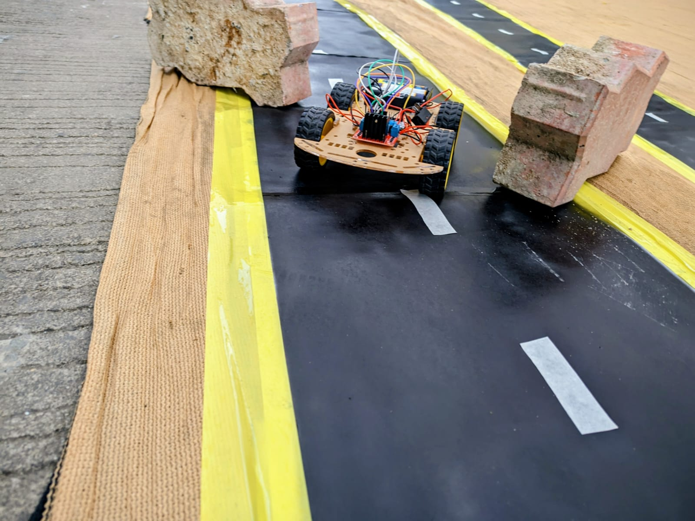
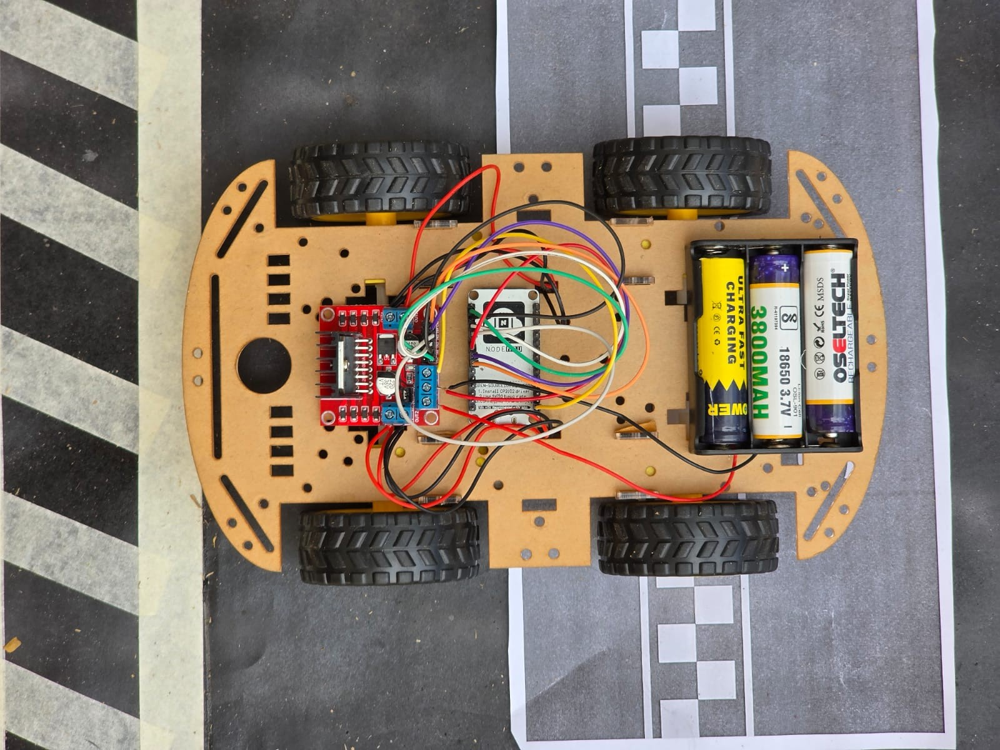
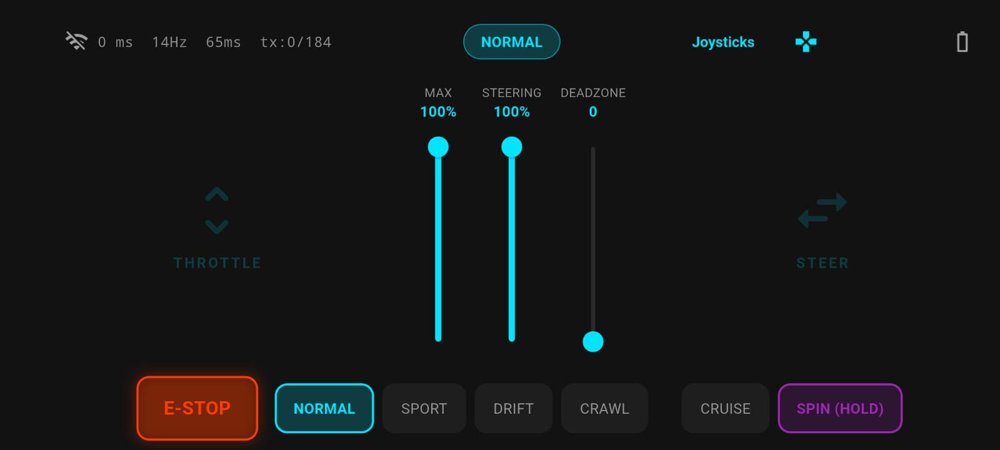
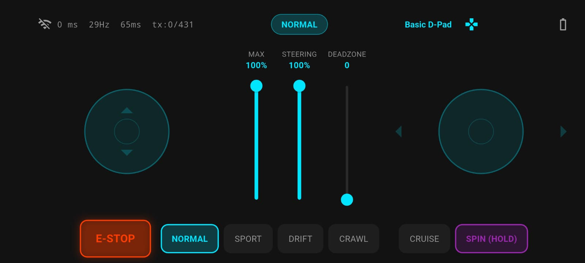

<p align="center">
  
</p>

<h1 align="center">RC Controller</h1>

<p align="center">
  <strong>Real-time UDP RC car controller for ESP8266 + L298N</strong>
  <br>
  3 control layouts · 4 drive modes · Adaptive telemetry · Dark neon UI
</p>

<p align="center">
  <a href="#features">Features</a> •
  <a href="#screenshots">Screenshots</a> •
  <a href="#hardware-setup">Hardware</a> •
  <a href="#quick-start">Quick Start</a> •
  <a href="#architecture">Architecture</a> •
  <a href="#project-structure">Structure</a>
</p>

<p align="center">
  <a href="https://github.com/parth1928/rc-car-controller/releases">
    
  </a>
  <a href="https://github.com/parth1928/rc-car-controller/blob/master/LICENSE">
    
  </a>
  <a href="https://flutter.dev">
    
  </a>
  <a href="https://www.arduino.cc/">
    
  </a>
</p>

---

Turn your phone into a **high-performance RC car remote**. This Flutter app communicates over UDP with an ESP8266-equipped car, delivering low-latency control, adaptive packet timing, and a dark neon gaming UI — all while providing real-time telemetry from the vehicle.

<div align="center">
  
</div>

---

## Features

<table>
  <tr>
    <td width="50%">
      <h3>🎮 3 Control Layouts</h3>
      <ul>
        <li><strong>Floating Joysticks</strong> — Dual analog sticks, tap-anywhere positioning</li>
        <li><strong>D-Pad</strong> — Discrete 8-way directional control</li>
        <li><strong>Retro Gamepad</strong> — Nintendo-style layout with action buttons</li>
      </ul>
      <h3>🏎️ 4 Drive Modes</h3>
      <ul>
        <li><strong>Normal</strong> — Balanced, all-purpose driving (cyan)</li>
        <li><strong>Sport</strong> — Aggressive steering curve, higher sensitivity (red)</li>
        <li><strong>Drift</strong> — Oversteer-biased for slides and turns (purple)</li>
        <li><strong>Crawl</strong> — Precision low-speed control (green)</li>
      </ul>
    </td>
    <td width="50%">
      <h3>⚙️ Drive Tuning</h3>
      <ul>
        <li><strong>Max Speed Limiter</strong> — Cap throttle 10–100% for indoor/beginner use</li>
        <li><strong>Steering Sensitivity</strong> — Adjustable 20–100% response curve</li>
        <li><strong>Joystick Deadzone</strong> — 0–20% threshold to filter thumb noise</li>
        <li><strong>Cruise Control</strong> — Lock current throttle, toggle on/off</li>
        <li><strong>360° Tank Spin</strong> — Hold-to-spin, full rotation on the spot</li>
        <li><strong>Emergency Stop</strong> — Big red button, kills all motors instantly</li>
      </ul>
    </td>
  </tr>
</table>

<table>
  <tr>
    <td width="50%">
      <h3>📡 Network</h3>
      <ul>
        <li><strong>UDP Protocol</strong> — Connectionless, sub-millisecond overhead</li>
        <li><strong>Broadcast Discovery</strong> — Auto-finds the ESP on 4 subnets</li>
        <li><strong>Adaptive Send Rate</strong> — 14–44 ms intervals based on input intensity</li>
        <li><strong>Live Telemetry</strong> — Ping (ms), send rate (Hz), TX success/fail</li>
        <li><strong>Connection Watchdog</strong> — Auto-reconnect with 300 ms health checks</li>
        <li><strong>Persistent Settings</strong> — All preferences saved across sessions</li>
      </ul>
    </td>
    <td width="50%">
      <h3>🎨 UI/UX</h3>
      <ul>
        <li><strong>Immersive Landscape</strong> — Fullscreen, no status bar or nav keys</li>
        <li><strong>Dark Neon Theme</strong> — Mode-specific accent colors with glow effects</li>
        <li><strong>Haptic Feedback</strong> — Vibrations on connect, mode change, E-stop, spin</li>
        <li><strong>Real-time Stats</strong> — Live ping, Hz, packet counters in status bar</li>
      </ul>
      <h3>🔧 Hardware (ESP8266)</h3>
      <ul>
        <li>WebSocket server with simulated car telemetry (RPM, temps, voltage, gear)</li>
        <li>mDNS support (<code>esp8266.local</code>)</li>
        <li>Auto-reconnect to Wi-Fi hotspot</li>
        <li>5 Hz telemetry broadcast</li>
      </ul>
    </td>
  </tr>
</table>

---

## Screenshots

<div align="center">
  <table>
    <tr>
      <td align="center"><strong>Floating Joystick Mode</strong></td>
      <td align="center"><strong>D-Pad Mode</strong></td>
    </tr>
    <tr>
      <td></td>
      <td></td>
    </tr>
  </table>
</div>

---

## Quick Start

### 1. Flash the ESP8266

| Component | Details |
|-----------|---------|
| **Board** | NodeMCU 1.0 (ESP-12E) / Wemos D1 Mini |
| **Driver** | L298N Motor Driver |
| **Motors** | 2x DC motors (differential drive) |
| **Power** | 7.4V–12V battery pack |

**Wiring:**

| ESP8266 | L298N | Function |
|---------|-------|----------|
| D1 (GPIO5) | IN1 | Motor A direction |
| D2 (GPIO4) | IN2 | Motor A direction |
| D3 (GPIO0) | IN3 | Motor B direction |
| D4 (GPIO2) | IN4 | Motor B direction |
| D5 (GPIO14) | ENA (PWM) | Motor A speed |
| D6 (GPIO12) | ENB (PWM) | Motor B speed |

```bash
# 1. Open ESP-CAR-CODE/ESP-CAR-CODE.ino in Arduino IDE
# 2. Set your phone hotspot SSID & password in the code:
#      const char* ssid = "YOUR_HOTSPOT_SSID";
#      const char* password = "YOUR_HOTSPOT_PASSWORD";
# 3. Install libraries: ESP8266WiFi, ESP8266mDNS, WebSocketsServer
# 4. Select board: NodeMCU 1.0 (ESP-12E)
# 5. Upload via USB
```

### 2. Build & Install the App

```bash
# Prerequisites: Flutter SDK 3.x
cd rc_controller_app

# Get dependencies
flutter pub get

# Run on connected device
flutter run

# Build release APK
flutter build apk --release
# APK at: build/app/outputs/flutter-apk/app-release.apk
```

### 3. Connect & Drive

1. Turn on the car — ESP8266 creates/joins the Wi-Fi network
2. Open the app — it auto-discovers the car via UDP broadcast
3. Status bar turns cyan and shows ping when connected
4. Select your layout, mode, and drive!

---

## Architecture

```
┌─────────────────────────────┐          UDP              ┌──────────────────────────┐
│      Flutter App (Phone)    │ ◄──────────────────────►  │     ESP8266 (Car)        │
│                             │   C,seq,thr,str,md,       │                          │
│  ┌───────────────────────┐  │   maxThr,deadzone         │  ┌────────────────────┐  │
│  │   UdpControlService   │──┼──────────────────────────►│  │  WebSocket Server  │  │
│  │   - Broadcast discov. │  │                           │  │  Port 81           │  │
│  │   - Ping/latency      │  │   P (ping)                │  │  mDNS: esp8266     │  │
│  │   - Connection watch. │  │◄──────────────────────────│  └─────────┬──────────┘  │
│  └───────────────────────┘  │   H (hello)               │            │              │
│  ┌───────────────────────┐  │◄──────────────────────────│  ┌─────────▼──────────┐  │
│  │   DriveController     │  │   S,throttle,steering,..  │  │  L298N Motor Driver│  │
│  │   - Adaptive send     │  │                           │  │  Left = Thr + Str  │  │
│  │   - Mode/curve logic  │  │                           │  │  Right = Thr - Str │  │
│  │   - 14-44ms interval  │  │                           │  └────────────────────┘  │
│  └───────────────────────┘  │                           │                          │
└─────────────────────────────┘                           └──────────────────────────┘
```

### Packet Protocol

| Type | Direction | Payload | Rate |
|------|-----------|---------|------|
| **Control** | App → ESP | `C,seq,throttle,steering,modeId,maxThrottle,deadzone` | Adaptive (14–44 ms) |
| **Ping** | App → ESP | `P` | 1 Hz |
| **E-Stop** | App → ESP | `E` | On demand |
| **Discovery** | App → ESP (broadcast) | `D` | 1 Hz (when disconnected) |
| **Hello** | ESP → App | `H` | On discovery response |
| **Pong** | ESP → App | `P` | On ping received |
| **Status** | ESP → App | `S,throttle,steering,mode,rssi` | 1 Hz |

### Failsafe

The ESP8266 implements a **400 ms dead-man's switch**: if no control packet is received within 400 ms, all motors are immediately stopped. This prevents runaway cars if the Wi-Fi connection drops.

---

## Project Structure

```
├── README.md                      # This file
├── images/                        # Project photos & screenshots
│   ├── Track-shot.jpeg
│   ├── RC-Car-top-shot.jpeg
│   ├── app-screenshot-joystick-mode.jpeg
│   └── app-screenshot-d-pad-mode.jpeg
│
├── rc_controller_app/             # Flutter application
│   ├── lib/
│   │   ├── main.dart              # App entry, landscape lock, immersive mode
│   │   ├── domain/
│   │   │   └── models.dart        # ControlPacket, StatusPacket
│   │   ├── services/
│   │   │   └── udp_service.dart   # UdpControlService
│   │   ├── features/
│   │   │   └── drive/             # Drive feature module
│   │   │       ├── drive_screen.dart
│   │   │       ├── drive_controller.dart
│   │   │       ├── gamepad_joystick.dart
│   │   │       └── control_layouts.dart
│   │   └── theme/
│   │       └── app_theme.dart     # Dark neon theme
│   ├── test/
│   │   └── widget_test.dart
│   └── pubspec.yaml
│
├── ESP-CAR-CODE/                  # ESP8266 Arduino firmware
│   └── ESP-CAR-CODE.ino
│
└── explanation.md                 # Full architecture & integration guide
```

---

## Development

```bash
# Run tests
flutter test

# Analyze for issues
flutter analyze

# Build APK
flutter build apk --release

# Build Android App Bundle (Play Store)
flutter build appbundle --release
```

---

## License

[MIT](LICENSE)

---

<p align="center">
  Built with ❄️ Flutter & 🔥 ESP8266
  <br>
  <a href="https://github.com/parth1928/rc-car-controller/releases">Download latest APK</a>
</p>
